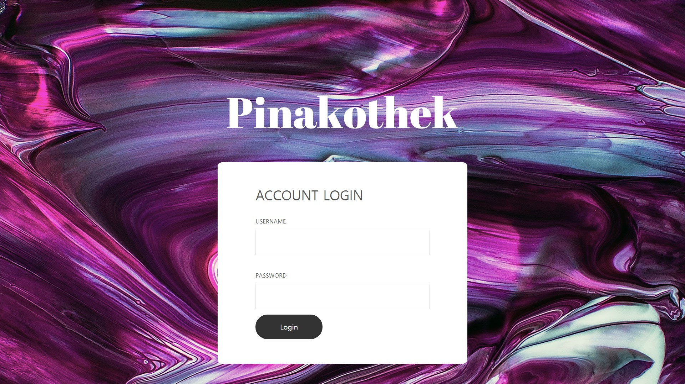
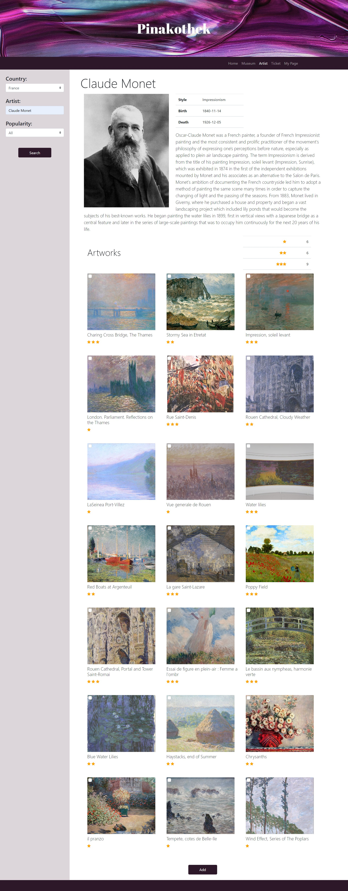
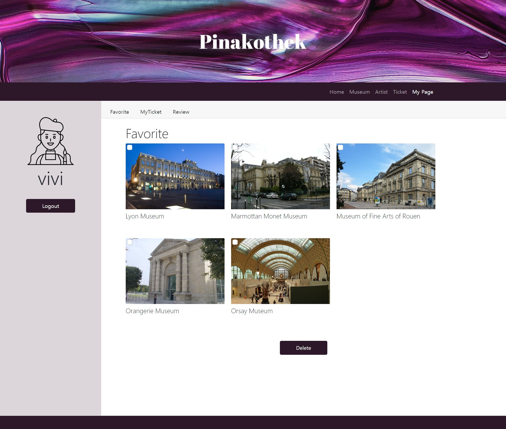
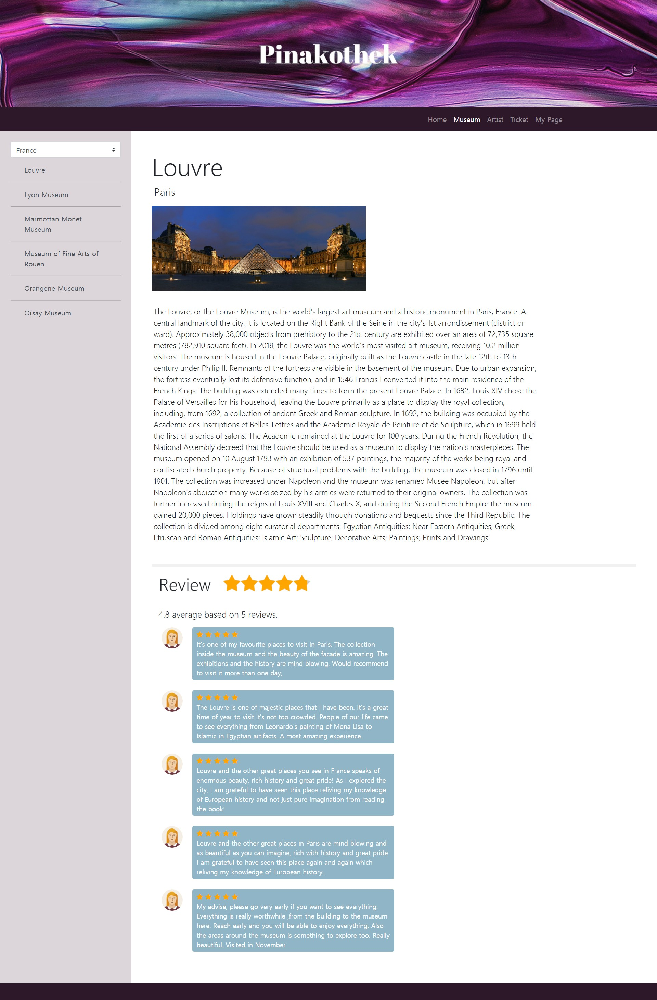
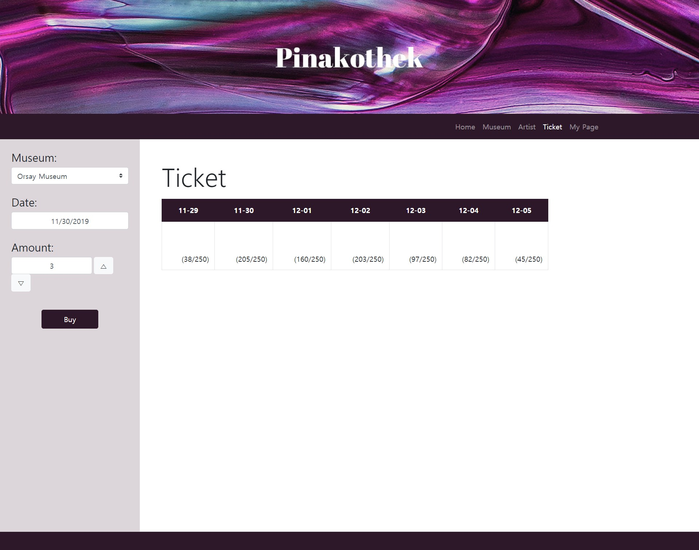
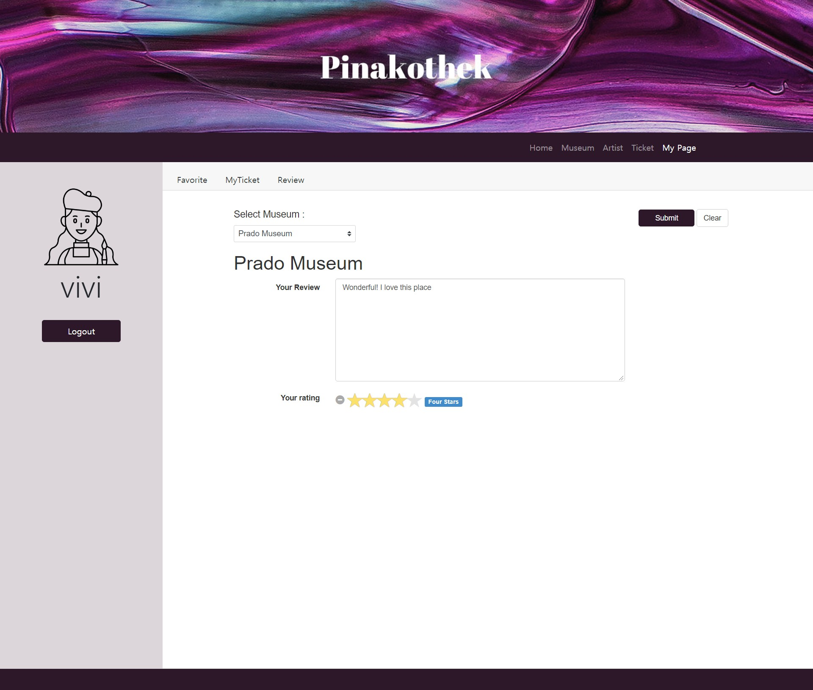
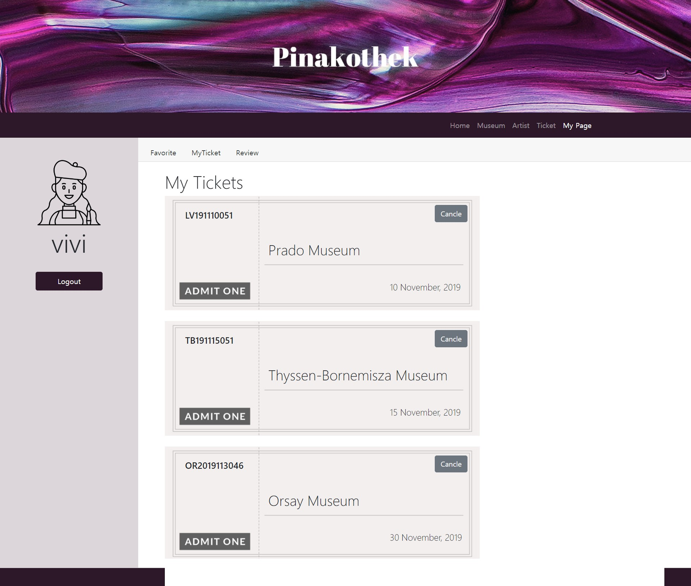

# pinakothek
+ Database Applicaition 2인 프로젝트 | 2019.10
+ 해외 미술관의 작품 검색, 티켓 예매 기능, 리뷰 및 평점 서비스를 제공하는 주제의 프로젝트
+ 역할 | DB 설계 및 데이터 수집, MySQL 쿼리 작성, 미술관과 작품 검색, 티켓 예매, 리뷰 작성, 조회 기능 구현
+ 기술 스택 | JDBC, MariaDB, PHP, Ajax, HTML, CSS, javascript

# 데이터베이스 설계

# 구현 화면
## 메인 화면

## 로그인 화면

 
## 아티스트 및 작품 조회 화면

## 선호 미술관 조회 화면

## 미술관 조회 화면

## 티켓 예매 화면

## 리뷰 작성 화면

## 티켓 조회 화면
